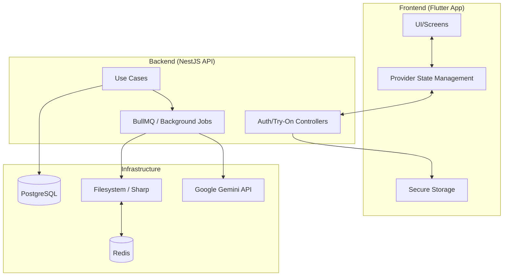
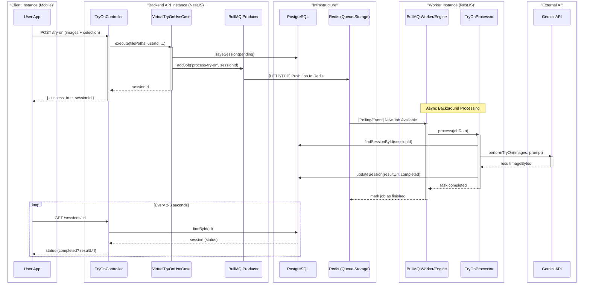

# Las Prendas - Project Infrastructure

This document provides a comprehensive overview of the technical architecture and infrastructure of the **Las Prendas** virtual try-on application.

## High-Level Architecture

The project follows a modern client-server architecture with a clear separation of concerns, utilizing **Hexagonal Architecture (Ports & Adapters)** on the backend for scalability and maintainability.



---

## Component Details

### 1. Frontend (Mobile App)
*   **Framework**: [Flutter](https://flutter.dev/) (Dart)
*   **State Management**: `Provider` package for reactive UI and global data flow.
*   **Security**: `flutter_secure_storage` for persistsing JWT tokens and user session data.
*   **Network**: Custom `ApiService` built on top of the `http` package, handling automated token attachment and error management.
*   **Key Features**:
    *   Image picking (Gallery/Camera) and Clipboard support.
    *   Interactive Viewer with zoom/pan for try-on results.
    *   Dynamic closet management with soft-delete logic.

### 2. Backend (REST API & Services)
*   **Framework**: [NestJS](https://nestjs.com/) (TypeScript)
*   **Pattern**: Hexagonal Architecture.
*   **Storage**: TypeORM with PostgreSQL.
*   **Authentication**: JWT-based security using Passport.js strategies.
*   **Background Jobs**: BullMQ + Redis for asynchronous processing of AI try-on tasks, ensuring the API remains responsive.
*   **AI Integration**: Custom adapter for **Google Gemini Pro Vision** to perform high-fidelity virtual try-ons.
*   **Image Handling**: `sharp` for high-performance image resizing, normalization, and aspect-ratio adjustment.

### 3. Infrastructure & DevOps
*   **Containerization**: [Docker](https://www.docker.com/) and `docker-compose` for local development orchestration.
*   **Database**: PostgreSQL for persistent storage (Users, Garments, Sessions).
*   **Caching/Message Broker**: Redis for job queuing and potentially caching.
*   **Deployment Environment**: Designed to be portable across cloud providers (AWS, GCP, etc.).

---

## Data Flow: Virtual Try-On Process



1.  **Request**: User selects garments on the mobile app and triggers "Try-On".
2.  **Upload**: Frontend sends files and existing garment IDs to the Backend.
3.  **Queue**: Backend saves the session in DB (status: pending) and pushes a job to **BullMQ**.
4.  **Process**: The worker (TryOnProcessor) picks up the job, fetches the artifacts, and calls the Gemini API.
5.  **Store**: Result image is saved to the filesystem, and the session status is updated in the DB.
6.  **Polling**: Frontend polls for results to fetch the finalized image.

---

## Project Structure

```text
lasprendas/
├── backend/                # NestJS Source
│   ├── src/
│   │   ├── application/    # Use Cases & Services
│   │   ├── domain/         # Entities & Port Definitions
│   │   └── infrastructure/ # Database, Auth & API Adapters
│   └── assets/             # Mannequin base anchors
├── frontend/               # Flutter Source
│   ├── lib/
│   │   ├── providers/      # Global state
│   │   ├── screens/        # UI Views
│   │   └── services/       # API integration
│   └── assets/             # Mobile assets
└── docker-compose.yml      # Service orchestration
```
